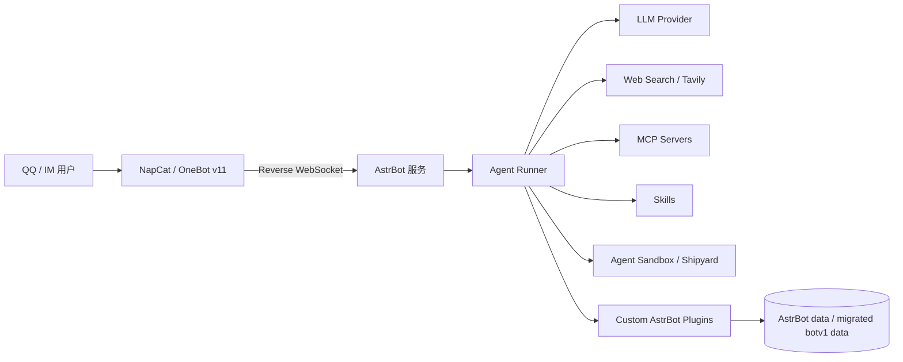

# AstrBot Migration Overview

本文档用于规划将现有 `/home/ubuntu/botv1` NoneBot2 机器人迁移到 AstrBot 的总体方案。目标目录为 `/home/ubuntu/astrbot`，本文档后续会同步到服务器的 `/home/ubuntu/astrbot/docs/overview.md`。

## 1. 结论

AstrBot 可以显著提升机器人的 AI 交互上限，但提升不是“换框架自动发生”的，而是来自三件事：

1. 使用支持函数调用、视觉/多模态、长上下文和稳定工具调用的大模型。
2. 把机器人能力从“命令触发插件”改造成“Agent 可调用工具”，例如搜索、总结、表情包选择、图片发送、文件处理、Shell/代码执行等。
3. 给 Agent 明确的执行边界，包括权限、超时、审计日志、沙盒、白名单工具和群聊触发策略。

NoneBot2 适合做事件驱动和命令式机器人；AstrBot 更接近 Agentic IM ChatBot Infrastructure，官方能力包含 Agent Runner、工具调用、MCP、网页搜索、知识库、Skills、Computer Use 和沙盒环境。对我们这个项目而言，AstrBot 的价值不是替代所有业务逻辑，而是把当前 `bot-llmchat` 这类 AI 交互逻辑升级为“可规划、可调用工具、可观察结果、可二次决策”的 Agent 流程。

## 2. AI 交互能力提升评估

### 2.1 自主图片与情绪决策

当前 `botv1` 已经有表情包相关能力：

- `src/plugins/bot-llmchat/emoji_manager.py`
- `src/plugins/bot-llmchat/emotion_analyzer.py`
- `src/plugins/bot-emoji-collector/`
- 数据目录：`/home/ubuntu/botv1/data/emojis/`

迁移到 AstrBot 后，建议将其重构为 Agent 工具，而不是继续写成固定命令：

- `analyze_mood(message, context) -> emotion_tags`
- `search_emoji(tags, scene, limit) -> emoji_candidates`
- `send_emoji(candidate_id) -> message_result`
- `collect_emoji(image, source_context) -> stored_metadata`
- `cleanup_emoji(policy) -> cleanup_result`

Agent 在回复前可以先判断情绪、语境和用户意图，再决定是否调用 `search_emoji`，最后决定发送文字、图片或混合消息。这样比 NoneBot 插件里硬编码“何时发图”更自然，也更容易加人设、群聊规则和频率控制。

需要注意：AstrBot 本身不会自动理解你的表情库语义。我们仍然需要迁移或重写你现有的表情元数据、情绪标签、候选筛选和冷却策略。真正的提升来自“让模型能调用这些工具并根据观察结果继续决策”。

### 2.2 复杂问题搜索能力

AstrBot 官方支持网页搜索，搜索源包括 default、Tavily、百度 AI 搜索，官方推荐 Tavily。它依赖模型的函数调用能力。对复杂问题，推荐做成三层：

1. 内置 Web Search：处理近期信息、链接总结、事实核验。
2. MCP 工具：接入专用数据源，例如 GitHub、文件系统、数据库、Arxiv、浏览器检索等。
3. 本地知识库：沉淀固定资料，例如项目文档、群规、常见问题、历史总结。

这会比 NoneBot 中“收到消息 -> 调一次 LLM -> 返回文本”的形态强很多，因为 Agent 可以执行 `搜索 -> 阅读 -> 总结 -> 再搜索 -> 形成答案` 的循环。

### 2.3 执行操作能力

AstrBot 的 Agent Runner 是“思考 + 执行”的层，能够处理多轮工具调用。Computer Use 决定 Agent 是否能执行 Shell、Python、文件访问等能力，运行模式包括 `none`、`local`、`sandbox`。生产环境建议默认使用 `sandbox`，避免 Agent 直接操作宿主机。

对服务器部署而言，执行能力必须分级：

- 普通群聊用户：默认只能聊天、搜索、调用安全工具。
- 白名单用户：可以触发部分受控工具，例如总结、查询、表情库维护。
- 超级用户：可以请求更高权限工具，但仍建议经由沙盒和审计。

## 3. 目标架构



建议目录结构：

```text
/home/ubuntu/astrbot/
  .codex/
    skills/
      gm/
      pr/
  docs/
    overview.md
    deployment.md
    migration-map.md
    plugin-design.md
    operations.md
  AstrBot/
    main.py
    pyproject.toml
    data/
      plugins/
        astrbot_plugin_llmchat_agent/
        astrbot_plugin_emoji/
        astrbot_plugin_jmcomic/
        astrbot_plugin_setu/
        astrbot_plugin_summary/
        astrbot_plugin_translate/
      plugin_data/
      config/
```

目录职责：

- `.codex/`：Codex 自动化 skill，例如 `gm` 和 `pr`。
- `docs/`：迁移和运维文档。
- `AstrBot/`：官方 AstrBot 源码目录，当前由 PyPI 官方源码包 `astrbot==4.23.6` 解压得到。
- `AstrBot/data/`：AstrBot 自己的持久化数据、配置、数据库和插件数据。
- `AstrBot/data/plugins/`：我们从 botv1 迁移过来的自定义 AstrBot 插件源码。
- `AstrBot/data/plugin_data/`：插件运行数据，避免写入插件源码目录。

## 4. 部署与使用方案

### 4.1 推荐部署方式

当前服务器不使用 Docker，因此推荐使用源码部署 AstrBot，并通过 systemd 用户服务常驻运行。官方源码部署支持 `uv sync && uv run main.py`，也支持传统 `python3 -m venv` 加 `pip install -r requirements.txt`。

在不使用 Docker 的前提下，Agent 执行能力分两阶段处理：

- 第一阶段：`Computer Use Runtime = none` 或 `local`，只开放给 AstrBot 管理员。
- 第二阶段：如确实需要隔离沙盒，再评估远端 Shipyard Neo/CUA 或单独沙盒机器。当前这台低配服务器不承载本地 Docker 沙盒。

基础端口规划：

- `6185`：AstrBot WebUI。
- `6199`：OneBot v11 反向 WebSocket。

服务器策略：

- 管理 WebUI 优先通过 SSH 隧道或反向代理访问，不建议直接裸露公网。
- 如果必须开放 WebUI，必须修改默认账号密码，并限制安全组来源 IP。
- NapCat WebUI 不应暴露公网。
- OneBot 反向 WebSocket 建议配置 token。
- 不安装 Docker，不把 Shipyard 当作第一阶段依赖。

### 4.2 初始搭建步骤

1. 创建项目目录：

```bash
mkdir -p /home/ubuntu/astrbot/docs
```

2. 选择部署模式：

- 第一阶段：源码部署 AstrBot，验证 WebUI、模型提供商、OneBot 连接。
- 第二阶段：启用 Built-in Agent Runner、Web Search、Skills。
- 第三阶段：将自定义插件接入 Agent 工具链。
- 第四阶段：按需评估远端沙盒，而不是在当前低配服务器上跑 Docker 沙盒。

3. 启动 AstrBot：

- 将 PyPI 官方源码包 `astrbot==4.23.6` 解压到 `/home/ubuntu/astrbot/AstrBot`。
- 使用 Python venv 和 `pip install -e .` 安装依赖。
- 因 GitHub 当前不可用，将源码包自带的 `dashboard-artifact/unpacked/dist` 放到 `astrbot/dashboard/dist`，避免运行时下载 Dashboard。
- 启动后访问 WebUI，默认账号密码需要立即修改。

4. 配置模型：

- 选择支持函数调用的模型作为主模型。
- 如果要做自主图片/搜索/工具执行，模型必须稳定支持 tool calling。
- 若涉及图片理解，需另配支持视觉输入的模型或专用图片分析工具。

5. 配置 Agent 能力：

- 启用 AstrBot Built-in Agent Runner。
- 启用 Web Search，搜索源优先 Tavily。
- 需要本地/代码执行时启用 Computer Use，生产环境优先 sandbox。
- 根据需要接入 MCP Servers。
- 上传/启用 Skills。

6. 配置消息平台：

- 在 AstrBot WebUI 创建 OneBot v11 机器人实例。
- AstrBot 作为服务端监听 `0.0.0.0:6199`。
- NapCat 或其他 OneBot 实现端作为客户端连接 `ws://127.0.0.1:6199/ws`，实际路径以 AstrBot WebUI 生成配置为准。

## 5. botv1 迁移方案

### 5.1 当前 botv1 状态

当前 `/home/ubuntu/botv1` 是 NoneBot2 项目：

- 启动方式：`screen` 会话内执行 `nb run`。
- 运行进程：`/home/ubuntu/botv1/.venv/bin/python`。
- NoneBot 版本：`2.4.2`。
- 适配器：OneBot V11。
- Driver：FastAPI。
- 端口：`127.0.0.1:8081`。
- 插件目录：`/home/ubuntu/botv1/src/plugins`。

现有插件：

- `bot-llmchat`
- `bot-emoji-collector`
- `bot-jmcomic`
- `bot-setu`
- `bot-dayanime`
- `bot-translate`
- `bot-summary`
- `bot-bigimage`
- `bot-help`
- `bot-data-cleaner`

### 5.2 迁移原则

迁移不是逐行搬运 NoneBot 插件，而是按能力边界拆分：

- 消息入口交给 AstrBot 平台适配层。
- AI 会话、工具调用和决策交给 Agent Runner。
- 原插件中的业务能力迁移为 AstrBot Plugin/Star 或 MCP 工具。
- 长期可复用的操作说明沉淀为 Skills。
- 高风险执行能力进入 Sandbox。

### 5.3 插件迁移优先级

第一优先级：AI 主链路。

- `bot-llmchat`：重构为 `astrbot_plugin_llmchat_agent`。
- 目标：让 Agent 负责上下文理解、工具选择、情绪决策和最终回复。

第二优先级：表情包。

- `bot-emoji-collector`
- `bot-llmchat/emoji_manager.py`
- `bot-llmchat/emotion_analyzer.py`
- 目标：迁移数据目录与元数据库，暴露给 Agent 作为可调用工具。

第三优先级：搜索/总结/翻译。

- `bot-summary`
- `bot-translate`
- Web Search / MCP
- 目标：把复杂信息处理从固定命令升级为 Agent 搜索与总结流程。

第四优先级：资源型插件。

- `bot-jmcomic`
- `bot-setu`
- `bot-dayanime`
- `bot-bigimage`
- 目标：先保留命令式能力，再逐步决定哪些可以开放给 Agent 自动调用。

第五优先级：运维与清理。

- `bot-data-cleaner`
- `bot-help`
- 目标：改成 AstrBot 管理命令、插件内置帮助和定时维护任务。

### 5.4 数据迁移

需要迁移的数据：

- `/home/ubuntu/botv1/data/emojis/`
- `/home/ubuntu/botv1/data/emojis/emoji_db.json`
- `/home/ubuntu/botv1/data/nonebot_plugin_jmdownloader/`
- `/home/ubuntu/botv1/cache/`
- 需要保留的插件配置文件和 YAML。

建议策略：

1. 先完整备份 `/home/ubuntu/botv1/data`、`/home/ubuntu/botv1/cache`、`.env`。
2. 敏感配置不直接复制进文档或 Git 仓库。
3. 表情包数据先以只读方式接入 AstrBot 插件，验证无误后再允许写入。
4. 数据格式转换脚本放在 `/home/ubuntu/astrbot/AstrBot/data/plugins/<plugin>/scripts/` 或 `/home/ubuntu/astrbot/docs` 关联的迁移脚本目录。

## 6. 切换方案

推荐并行迁移，不直接停掉 botv1。

1. 保持 botv1 继续在 `screen` 中运行。
2. 在 `/home/ubuntu/astrbot` 部署 AstrBot，但先不接入正式 QQ 账号或只接测试号/测试群。
3. 配置模型、Web Search、Agent Runner、沙盒。
4. 迁移 `llmchat + emoji` 最小闭环。
5. 使用测试群验证：

- 文本问答。
- 情绪识别。
- 是否自主选择发送表情。
- 搜索近期问题。
- 长问题分解与多轮工具调用。
- 群聊频率控制。
- 管理员权限控制。

6. 将 NapCat 的反向 WebSocket 从旧 NoneBot 地址切换到 AstrBot 地址。
7. 保留 botv1 一段时间作为回滚路径。
8. 稳定后停止 botv1 screen，并归档旧项目。

## 7. 风险与边界

关键风险：

- Agent 自动执行能力过强，可能误调用高风险工具。
- 群聊场景噪声大，需要触发策略、冷却和权限控制。
- 搜索能力依赖模型 function calling 和搜索源稳定性。
- 图片/表情发送依赖平台适配器的媒体消息支持。
- NapCat、AstrBot、插件各自都有数据持久化，备份策略要明确。
- AstrBot 使用 AGPL-v3 许可证，若修改 AstrBot 本体并用于商业网络服务，需要注意开源义务。

控制策略：

- 默认不开启 local Computer Use；如需开放，先做白名单、超时和审计。
- 所有高风险工具需要白名单用户触发。
- 每个工具设置超时、最大调用次数、参数校验和日志。
- 群聊自动图片发送需要频率限制。
- WebUI、NapCat、Shipyard 不暴露公网或严格限源。

## 8. 下一步文档拆分

后续建议继续补充这些文档：

- `deployment.md`：服务器源码部署、端口、防火墙、WebUI、systemd、NapCat 接入。
- `migration-map.md`：botv1 每个插件到 AstrBot 插件/工具/Skill 的映射。
- `plugin-design.md`：`llmchat_agent`、`emoji`、`summary` 等插件的接口设计。
- `security.md`：权限、沙盒、密钥、审计、群聊触发策略。
- `operations.md`：启动、停止、日志、备份、恢复、升级和回滚。

## 9. 参考资料

- AstrBot 官方介绍：https://docs.astrbot.app/what-is-astrbot.html
- AstrBot 源码部署：https://docs.astrbot.app/en/deploy/astrbot/cli.html
- AstrBot OneBot v11 接入：https://docs.astrbot.app/platform/aiocqhttp.html
- AstrBot Agent Runner：https://docs.astrbot.app/use/agent-runner.html
- AstrBot Web Search：https://docs.astrbot.app/use/websearch.html
- AstrBot MCP：https://docs.astrbot.app/en/use/mcp.html
- AstrBot Skills：https://docs.astrbot.app/en/use/skills.html
- AstrBot Computer Use：https://docs.astrbot.app/use/computer.html
- AstrBot Agent Sandbox：https://docs.astrbot.app/use/astrbot-agent-sandbox.html
- AstrBot 插件开发：https://docs.astrbot.app/en/dev/star/plugin-new.html
